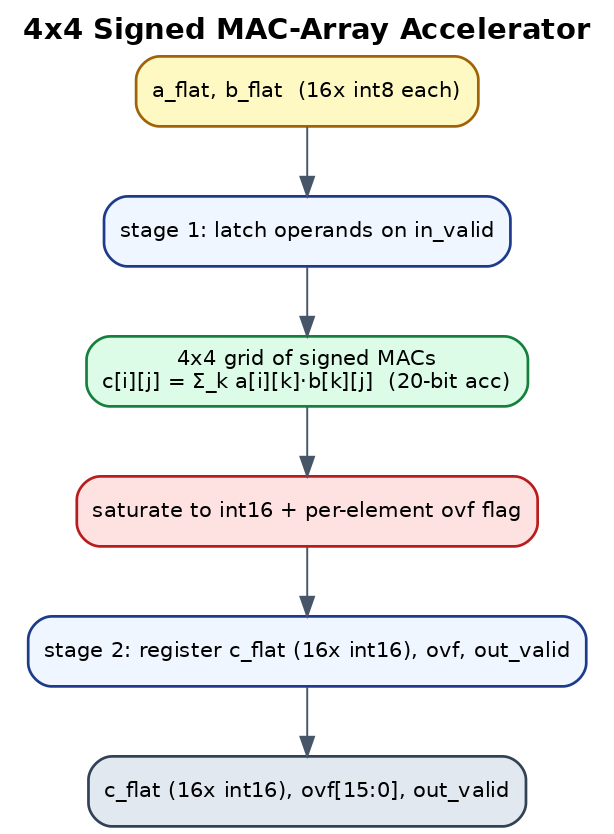
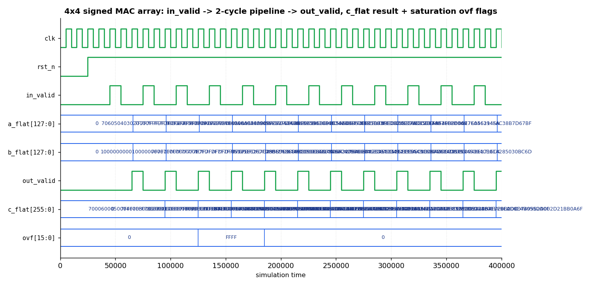

# AI MAC-Array Accelerator — SystemVerilog Verification


A 4×4 **signed MAC matrix-multiply accelerator** — the compute primitive at the heart of
AI/ML hardware (TPU systolic arrays, GPU tensor cores) — with a full **self-checking
SystemVerilog verification environment** and a **Python golden model**.

> Why this project: it speaks the language of AI-silicon teams (Google TPU, NVIDIA GPU) —
> MAC arrays, signed fixed-point, saturation, and the verification of all of it — while
> staying small enough to verify cleanly and defend in an interview.

## What the DUT does
`C = saturate16( A × B )` — A, B are 4×4 matrices of **signed 8-bit** elements; each output
is the dot product of an A-row and a B-column, accumulated exactly (20-bit) then
**saturated to signed 16-bit** with a per-element **overflow flag**. 2-stage pipeline.

## Architecture



```text
        a_flat (16×int8)            b_flat (16×int8)
              |                          |
              v                          v
   [ stage1: latch operands on in_valid ]
              |
              v
   [ 4×4 grid of signed MACs:  c[i][j] = Σ_k a[i][k]·b[k][j] ]
              |
   [ saturate to int16 + per-element ovf flag ]
              |
   [ stage2: register c_flat (16×int16), ovf, out_valid ]
```

## Waveform (real simulation output)



Captured from an actual simulation. It shows `in_valid` launching operands into the
**2-stage pipeline**, `out_valid` asserting with the `c_flat` result, and the
per-element **saturation flags** (`ovf` = `FFFF` when the all-max test saturates every
output). Confirms the pipeline latency and saturation behavior the self-check verifies.

## Verification environment (`tb/tb_mac_array.sv`)
- **Independent reference model** (nested-loop matmul + saturation) — not the DUT's logic.
- **Directed corners:** zeros, A×I (identity), all-max (saturates high), min×max (saturates
  low), small negative.
- **Constrained-random:** 60 random matrix pairs, self-checked every time.
- **Functional coverage:** `covergroup` over saturation-occurred × output-sign, with cross.
- **PASS/FAIL summary** + saturating-test count + coverage %.

## Coverage closure (measured)
`tb/tb_mac_cov.sv` tracks the covergroup bins so a real number is produced on Icarus
(which doesn't score covergroups natively): **100% functional coverage — 11/11 bins**
(`cp_sat` 2/2, `cp_sign` 3/3, cross 6/6), 66/66 tests passing. The one cross bin random
stimulus never hits — *saturation occurring while `c[0][0]==0`* — was **closed with a
directed test** (`sat_with_c00_zero`). Full output: [`proof/COVERAGE_REPORT.txt`](proof/COVERAGE_REPORT.txt).

## Golden model (`model/mac_ref.py`)
Python reference that computes `saturate16(A×B)` and self-tests its own arithmetic
(`python3 model/mac_ref.py`). Validated:
```
zeros×zeros   -> C[0][0]=0,      sat 0/16
A_mixed × I   -> C[0][0]=-8,     sat 0/16   (A×I = A)
max × max     -> C[0][0]=32767,  sat 16/16  (4·127·127=64516 -> saturates)
min × max     -> C[0][0]=-32768, sat 16/16
SELF-TEST PASS
```

## How to run
- **EDA Playground** (Questa/VCS — for covergroups): paste `rtl/mac_array_4x4.sv` (design)
  and `tb/tb_mac_array.sv` (testbench), top = `tb_mac_array`, run.
- **Icarus** (PASS/FAIL self-check; covergroups won't score):
  `iverilog -g2012 -o sim.out rtl/mac_array_4x4.sv tb/tb_mac_array.sv && vvp sim.out`

### Expected tail
```
[PASS] zeros      c[0][0]=0 sat=0/16
[PASS] max_sat    c[0][0]=32767 sat=16/16
...
MAC-ARRAY VERIFICATION SUMMARY
  tests=65  PASS=65  FAIL=0  saturating-tests=..
  Functional coverage = 100.00%
  RESULT: PASS
```

## What this demonstrates (for AI-silicon DV/RTL interviews)
- The **MAC/systolic compute primitive** of AI accelerators, in clean RTL.
- **Signed fixed-point arithmetic + saturation/overflow** handling and its verification.
- Reference-model **self-checking**, directed + constrained-random stimulus, and
  **functional coverage** — the full DV methodology applied to an ML-relevant block.

## Roadmap
- Stream interface (valid/ready) with back-pressure; weight-stationary dataflow.
- True pipelined **systolic** array with input skewing + latency/throughput counters.
- Wider/parameterized matrices and INT8→INT32 accumulate modes.
